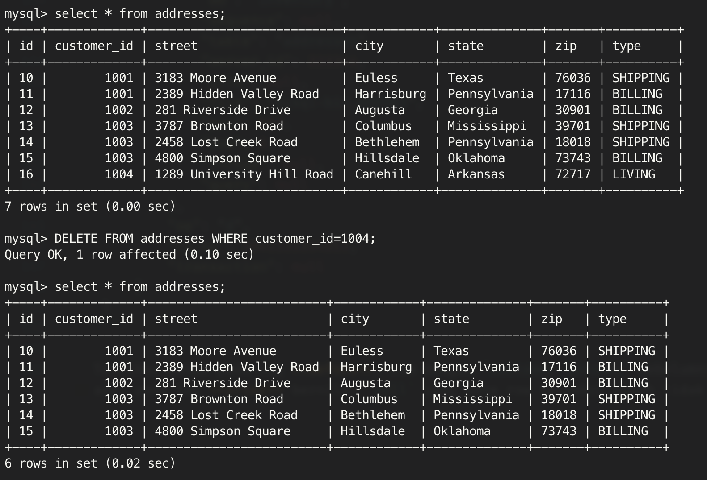

# Introduction to Kafka

**Essay**

Dari tutorial Kafka Debezium, delete records menggunakan command berikut

```sql
DELETE FROM addresses WHERE customer_id=1004;
```

Lalu salin hasil dari log before dan after.

**Penjelasan**

Langkah-langkah

1. Start services dan/atau shell untuk `Zookeeper`, `Kafka`, `MySQL`, `Kafka Connect`
   
   **Zookeeper**
  
   ```bash
   docker run -it --rm --name zookeeper -p 2181:2181 -p 2888:2888 -p 3888:3888 debezium/zookeeper:1.8
   ```

   **Kafka**
   ```bash
   docker run -it --rm --name kafka -p 9092:9092 --link zookeeper:zookeeper debezium/kafka:1.8
   ```

   **MySQL**
   Start service:

   ```bash
   docker run -it --rm --name mysql -p 3306:3306 -e MYSQL_ROOT_PASSWORD=debezium -e MYSQL_USER=mysqluser -e MYSQL_PASSWORD=mysqlpw debezium/example-mysql:1.8
   ```

   Start shell:

   ```bash
   docker run -it --rm --name mysqlterm --link mysql --rm mysql:8.0 sh -c 'exec mysql -h"$MYSQL_PORT_3306_TCP_ADDR" -P"$MYSQL_PORT_3306_TCP_PORT" -uroot -p"$MYSQL_ENV_MYSQL_ROOT_PASSWORD"'
   ```

   Kemudian, gunakan command berikut untuk mengetahui informasi pada table `addresses`

   ```sql
   use inventory;

   show tables;

   SELECT * FROM addresses;
   ```

   **Kafka Connect**
   Start service:

   ```bash
   docker run -it --rm --name connect -p 8083:8083 -e GROUP_ID=1 -e CONFIG_STORAGE_TOPIC=my_connect_configs -e OFFSET_STORAGE_TOPIC=my_connect_offsets -e STATUS_STORAGE_TOPIC=my_connect_statuses --link zookeeper:zookeeper --link kafka:kafka --link mysql:mysql debezium/connect:1.8
   ```

   Untuk melakukan pengecekan status dari Kafka Connect:

   ```bash
   curl -H "Accept:application/json" localhost:8083/
   ```
   Untuk melakukan pengecekan status connectors:

   ```bash
   curl -H "Accept:application/json" localhost:8083/connectors/
   ```

2. Mendaftarkan `connectors` untuk memantau database
   
   ```bash
   curl -i -X POST -H "Accept:application/json" -H "Content-Type:application/json" localhost:8083/connectors/ -d \
    '{
        "name": "inventory-connector",
        "config": {
            "connector.class": "io.debezium.connector.mysql.MySqlConnector",
            "tasks.max": "1",
            "database.hostname": "mysql",
            "database.port": "3306",
            "database.user": "debezium",
            "database.password": "dbz",
            "database.server.id": "184054",
            "database.server.name": "dbserver1",
            "database.include.list": "inventory",
            "database.history.kafka.bootstrap.servers": "kafka:9092",
            "database.history.kafka.topic": "dbhistory.inventory"
        }
    }'
   ```

   Untuk melakukan pengecekan status `connectors`:

   ```bash
   curl -i -X GET -H "Accept:application/json" localhost:8083/connectors/inventory-connector
   ```

3. Watch the topic
   
   ```bash
   docker run -it --rm --name watcher --link zookeeper:zookeeper --link kafka:kafka debezium/kafka:1.8 watch-topic -a -k dbserver1.inventory.addresses
   ```

4. Sesuai case pada essay, DELETE row pada table `addreses` dimana `customer_id=1004`
   
   ```sql
   DELETE FROM addresses WHERE customer_id=1004;
   ```
5. Output sebelum query tersebut dijalankan dan setelah dijalankan.
   
   **LOG BEFORE dan AFTER**

   ```json
   {
    "schema": {...},
        "payload": {
            "before": {
                "id": 16,
                "customer_id": 1004,
                "street": "1289 University Hill Road",
                "city": "Canehill",
                "state": "Arkansas",
                "zip": "72717",
                "type": "LIVING"
            },
            "after": null,
            "source": {
                "version": "1.8.1.Final",
                "connector": "mysql",
                "name": "dbserver1",
                "ts_ms": 1645333354000,
                "snapshot": "false",
                "db": "inventory",
                "sequence": null,
                "table": "addresses",
                "server_id": 223344,
                "gtid": null,
                "file": "mysql-bin.000003",
                "pos": 397,
                "row": 0,
                "thread": null,
                "query": null
            },
            "op": "d",
            "ts_ms": 1645333354813,
            "transaction": null
        }
    }
   ```

   Terlihat bahwa pada log **before**, row dengan `customer_id=1004` sebelumnya ada pada tabel `addresses` ada, pada log **after** bernilai `null` yang mana row tersebut sudah tidak ada. Data `"op": "d"` berarti ada operasi menghapus data. Untuk membuktikannya, kita bisa lakukan query pada mysql dan berikut hasilnya.

   

